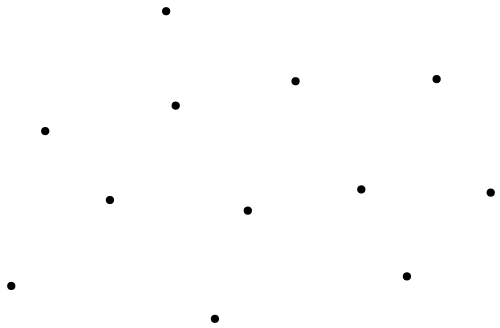
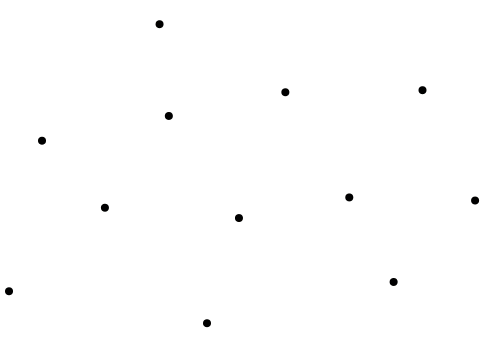
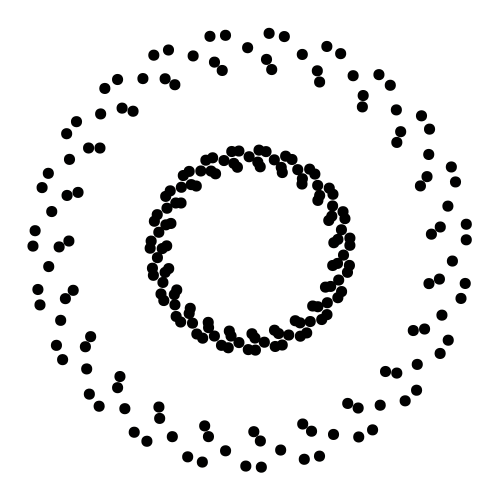
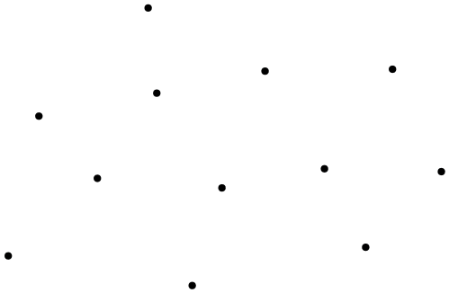
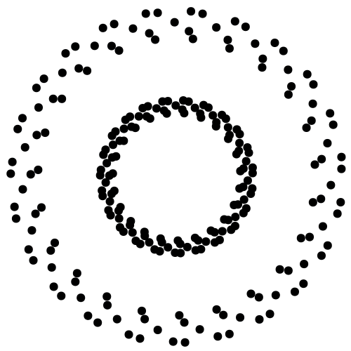
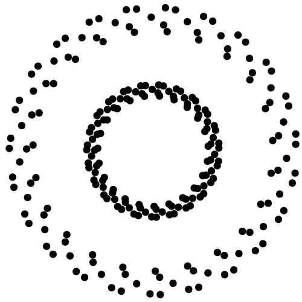
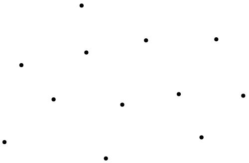
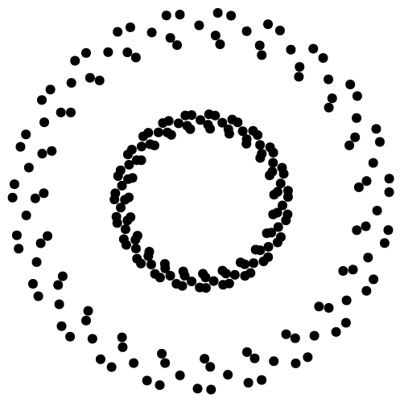
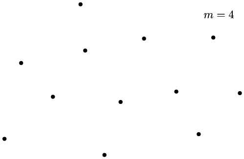
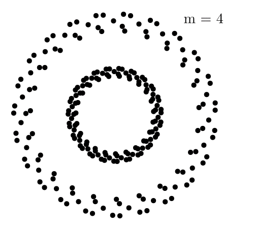

# Visualization of convex hull algorithms in [Ipe](https://ipe.otfried.org/)

This Ipelet implements the most important algorithms found in literature to calculate the [convex hull](https://en.wikipedia.org/wiki/Convex_hull) of a given set of points.

For each algorithm, individual views are created with a visualization of the intermediate steps.
This allows you to use them in a presentation or to generate animations from it.
The animations below have been generated with the [ipe-animate-views](https://github.com/Marian-Braendle/ipe-animate-views) Ipelet.

## Usage

Select all marks that should be included in the convex hull. Run the desired algorithm under `Ipelets -> Convex Hull`.

## Convex hull algorithms

In the following, the individual algorithms are each described very briefly and informally and the generated animation is shown.

### Brute-force

There are several different approaches to calculate the convex hull naively and inefficiently.
I have chosen the one that was easiest for me to implement. It has a time complexity of $\mathcal{O}(n^3)$.

#### Working principle of the algorithm

- Foreach pair of points $p$, $q$
  - Divide the space into two regions separated by the line through $p$ and $q$
  - If one of the regions does not contain any points, the segment through $p$ and $q$ belongs to $\mathcal{CH}$

| Simple Test Set | Circular Pattern | Collinear Points |
| :-------------: | :--------------: | :--------------: |
|  |  |  |

---

### Graham Scan

- Paper by Ronald Graham (1972): https://doi.org/10.1016/0020-0190(72)90045-2
- Points are sorted
- Points on $\mathcal{CH}$ are maintained on a stack
- Overall time complexity: $\mathcal{O}(n\log n)$

#### Working principle of the algorithm

- Choose lowest and leftmost point as $P_0$ (guaranteed to be in $\mathcal{CH}$)
- Sort all points by angle from $P_0$
- For each point $P_i$
  - While $P_i$ forms a right turn with the last two points on the stack
    - Pop from the stack
  - Push $P_i$ onto the stack
- The stack now contains $\mathcal{CH}$

| Simple Test Set | Circular Pattern | Collinear Points |
| :-------------: | :--------------: | :--------------: |
|  |  |  |

---

### Jarvis March

- Also called "gift wrapping" algorithm
- Paper by Ray Jarvis (1973): https://doi.org/10.1016/0020-0190(73)90020-3
- Output-sensitive algorithm with time complexity $\mathcal{O}(nh)$, where $h$ is the number of hull vertices
- If $h < \log n$, it is faster than $\mathcal{O}(n \log n)$ algorithms like Graham scan

#### Working principle of the algorithm

- Choose leftmost point as $P_0$ that is known to be in $\mathcal{CH}$
- Add $P_0$ to the current set of convex hull points
- Repeat
  - Get next point $P_i$ on $\mathcal{CH}$: point with the smallest right turn
  - Stop if $P_i = P_0$
  - Add $P_i$ to the current set of convex hull points

| Simple Test Set | Circular Pattern | Collinear Points |
| :-------------: | :--------------: | :--------------: |
|  |  |  |

---

### Quickhull

- Divide and conquer
- Worst case time complexity: $\mathcal{O}(n^2)$

#### Working principle of the algorithm

- Find the two horizontal extrema $p$ and $q$
- Divide the given points into two subset by a line through $p$ and $q$
- Find point furthest away from the line forming a triangle with $p$ and $q$
- Only points outside the triangle can be part of $\mathcal{CH}$
- Recursively repeat from step 2 with each leg of the triangle, base case: empty set of points

| Simple Test Set | Circular Pattern | Collinear Points |
| :-------------: | :--------------: | :--------------: |
|  |  |  |

---

### Andrew's monotone chain algorithm

- Paper by A.M. Andrew (1979): https://doi.org/10.1016/0020-0190(79)90072-3
- Time complexity: $\mathcal{O}(n\log n)$ ($\mathcal{O(n)}$ if already sorted)
- First, a lower hull and an upper hull are calculated, which are then combined
- Points are each maintained on a stack

#### Working principle of the algorithm

- Sort points lexicographically (first by $x$ and then by $y$)
- Construct lower hull:
  - For each point $P_i$ in the sorted list
    - While the top two points on the stack do not make a right turn
      - Pop from stack
    - Push $P_i$ onto the stack
- Construct upper hull:
  - For each point $P_i$ in reverse order
    - While the top two points on the stack do not make a right turn
      - Pop from stack
    - Push $P_i$ onto the stack
- Combine lower and upper hull

| Simple Test Set | Circular Pattern | Collinear Points |
| :-------------: | :--------------: | :--------------: |
|  |  |  |

---

### Kirkpatrick-Seidel algorithm

- Paper by David Kirkpatrick & Raimund Seidel (1986): https://doi.org/10.1137/0215021
- Output-sensitive algorithm with time complexity $\mathcal{O}(n \log h)$
- Divide and conquer

#### Working principle of the algorithm

- Recursively divide the set of points horizontally into two subset, base case: n <= 3 in CCW order
- Merging step: merge two sub hulls together by finding an upper and a lower bridge (more or less the hard part)

| Simple Test Set | Circular Pattern | Collinear Points |
| :-------------: | :--------------: | :--------------: |
|  |  |  |

---

### Chan's algorithm

- Paper by T.M. Chan (1996): https://doi.org/10.1007/BF02712873
- Combination of Graham scan with Jarvis march
- Output-sensitive algorithm with time complexity $\mathcal{O}(n \log h)$

#### Working principle of the algorithm

- Initialize parameter $m$
- Arbitrarily partition set of points into $\lceil\frac{n}{m}\rceil$ subsets
- For each subset, calculate its convex hull with Graham scan, for example
- Perform Jarvis march with all points of those sub-hulls
  - Here, the next point can be found efficiently with binary search
  - If the starting point could not be reached within $m$ steps, start all over again with $m \leftarrow m \cdot m$
  - If the starting point could be reached again, the overall convex hull has been found

| Simple Test Set | Circular Pattern | Collinear Points |
| :-------------: | :--------------: | :--------------: |
|  |  |  |
